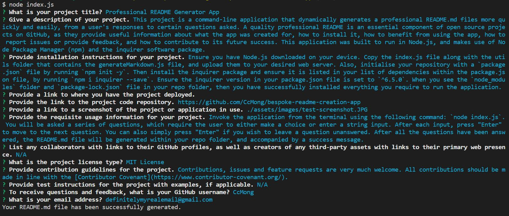

# Professional README Generator App  

  

  

## Description  

This project is a command-line application that dynamically generates a professional README.md files more quickly and easily, from a user's responses to certain questions asked. A quality professional README is an essential component of open source projects on GitHub, as they provide useful information about what the app was created for, how to install it, how to benefit from using the app, how to report issues or provide feedback, and how to contribute to its future success. This application was built to run in Node.js, and makes use of Node Package Manager (npm) and the inquirer software package. 

## Table of Contents  

- [Description](#description)  
- [Installation](#installation)  
- [Usage](#usage)  
- [Credits](#credits)  
- [License](#license)  
- [Contributing](#contributing)  
- [Tests](#tests)  
- [Questions](#questions)

  

## Installation  

Ensure you have Node.js downloaded on your device. Copy the index.js file along with the utils folder that contains the generateMarkdown.js file, and upload them to your desired web server. Also, initialise your repository with a `package.json` file by running `npm init -y`. Then install the inquirer package and ensure it is listed in your list of dependencies within the package.json file, by running `npm i inquirer --save`. Ensure the inquirer version in your package.json file is set to `^6.5.0`. When you see the `node_modules` folder and `package-lock.json` file in your repo folder, then you have successfully installed everything you require to run the application.  

  

## Usage  
  
  

[Link to Project Code Repository](https://github.com/CcMong/bespoke-readme-creation-app)  

  

Invoke the application from the terminal using the following command: `node index.js`. You will be asked a series of questions, which require the user to either make a choice or enter a string input. After each input, press "Enter" to move to the next question. After all the questions have been answered, the README.md file will be generated within your repo folder, and accompanied by a success message.  

  

## Credits  

N/A  

  

## License  

This project is covered under the MIT License. Please refer to the LICENSE documentation for further information.  

  

## Contributing  

Contributions, issues and feature requests are very much welcome. All contributions should be made in line with the [Contributor Covenant](https://www.contributor-covenant.org/).  

  

## Tests  

N/A  

  

## Questions  

Please feel free to reach out with any questions or feedback you might have. You can contact me through:  

* GitHub: [@CcMong](https://github.com/CcMong)
* Email: definitelymyrealemail@gmail.com

